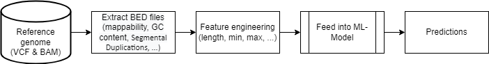

# NIST Genomic features 
## Giab Benchmarks

Genome in a bottle 
([GIAB](https://www.nist.gov/programs-projects/genome-bottle)) 
is a benchmark data set for small variants and structural variant benchmarks. The GIAB Consortium is a public-private academic consortium hosted by the NIST. It develops the technical infrastructure like the reference standards, methods and data, to enable translation of whole human genome sequencing to clinical practice and innovations in technologies. For this GIAB provides a pilot genome based on the 
[HapMap](https://www.genome.gov/10001688/international-hapmap-project) 
Project and the
[Personal Genome Project](https://www.personalgenomes.org/us). 
Genome data is publically available via 
[FTP](https://ftp-trace.ncbi.nlm.nih.gov/giab/ftp/release/).

**#TODO**:
Releases evaluated against a variety of call sets
Resource development process described in manuscripts and pre-prints

## Stratification
In addition to the reference genome, GIAB also provides stratification files in the form of BED files. These files are intended to be used to evaluate the behavior of bioinformatic tools, in for example difficult regions on the human genome, in a standardized way. The stratification files can be divided into seven types: Low Complexity, Functional Technically Difficult, Genome Specific, Functional Regions, GC content, mappability, Other Difficult, Segmental Duplications, Union, Ancestry and XY.

For this project the following types are being investigated in more details for the mappability of prediction onto the genome:

| Type. |Description | Number of Stratification |
|:---: |:-------------: | :-------------: |
|Low Complexity|Regions with different types and sizes of low complexity sequence, e.g., homopolymers, STRs, VNTRs and other locally repetitive sequences. | GRCh37 (28), GRCh38 (28), CHM13v2.0 (27)|
|Segmental Duplication | Regions with segmental duplications or regions with non-trivial self-chain alignments. |GRCh37 (9), GRCh38 (9), CHM13v2.0 (2)  |
|GC Content|Regions with different ranges (%) of GC content.| GRCh37 (14) and GRCh38 (14)|
|TR| **#TODO** | **#TODO** |

The stratification files can also be downloaded via the [GIAB genome stratification](https://ftp-trace.ncbi.nlm.nih.gov/ReferenceSamples/giab/release/genome-stratifications/) FTP.

## Flowchart 

## Tasks
| No. |Task  | Responsible Person |
|:---: |:-------------: | :-------------: |
|S1. | **Mappability for CHM13v2.0 reference genome** | Pilar|
|S2. | **GC content for the CHM13v2** | Eddy|
|S3. | **Gene coding sequence for CHM13v2** | Divya and Pilar|
|S4. | **Lift over Other Difficult regions to CHM13v2** ||
|S5. | **Tandem Repeat (TR) Feature** | Bharati, Divya and Nathan|
|S6. | **Distribution of variants in Tandem repeats and homopolymer** | Nathan|
|S7. | **Distribution of adjacent variants** | Sina|
|S8. | **Coverage of variants from a bam file** | Philippe|
