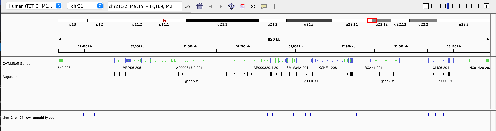

# Mappability for CHM13v2.0 reference genome
Pilar Alvarez Jerez \
Last update: October 12, 2022 \
Based on [GIAB CRCh38 Stratifications](https://github.com/genome-in-a-bottle/genome-stratifications/blob/master/GRCh38/mappability/GRCh38-mappability-README.md) \
All the following code can also be found in Github [code folder](https://github.com/collaborativebioinformatics/NIST-GREX/tree/main/S1-mappability/code)
## Goal: 
Generate T2T-CHM13v2.0 stratification BED file similar to what exists for GRCh38. Goal is to end with BED file with regions of low mappability per chromosome based on two stringency levels.
## Done:
Generated all final mappability files for chr21 \
Generated all final mappability files for whole genome CHM13
## To do:
Plot mappability for better visualization

## Example on how to run on one chromosome

Set up working directory

	export MAIN=/home/
	mkdir $MAIN/sv_hackathon/
	cd $MAIN/sv_hackathon
	

First extract chromosome from CHM13v2.0 fasta file

	
	module load samtools
	samtools faidx chm13v2.0.fa.gz chr21 > 	chm13_chr21.fa.gz
	samtools faidx chm13_chr21.fa.gz

Download and install bedops and GEM binaries in your directory

[Links](https://github.com/genome-in-a-bottle/genome-stratifications/blob/master/GRCh38/mappability/GRCh38-mappability-README.md) to both binaries

	# On $MAIN directory
	tar jxvf bedops_linux_x86_64-v2.4.41.tar.bz2
	tar jxvf GEM-binaries-Linux-x86_64-core_i3-20130406-045632.tbz2

### Upload first GEM script to directory
[Original script](https://github.com/genome-in-a-bottle/genome-stratifications/blob/master/GRCh38/mappability/run_GEM_mappability_GRCh38.sh) \
Renamed as [gem_mappability.sh](https://github.com/collaborativebioinformatics/NIST-genomic-features/blob/main/S1-mappability/code/gem_mappability.sh) for this project \
What to alter in script:
- Main variable paths/names
- l, m, e parameters

### Running script for chr21
	sbatch gem_mappability.sh
Note, running twice. 
-   low stringency: l-100, m-2, e-1 (2 mismatches and 1 indels)
-   high stringency: l-250, m-0, e-0 (0 mismatches and 0 indels)

Running the script generates raw mappability files.
Example output from script

- **`chm13_chr21_gemmap_l100_m2_e1_name_uniq.bed`**
- **`chm13_chr21_gemmap_l100_m2_e1.bed`**
- `chm13_chr21_gemmap_l100_m2_e1_name_clean.sizes`
- `chm13_chr21_gemmap_l100_m2_e1_name_clean.wig`
- `chm13_chr21_gemmap_l100_m2_e1.mappability`
- `chm13_chr21_gemmap_l100_m2_e1.sizes`
- `chm13_chr21_gemmap_l100_m2_e1.wig`

Interested in bed files for now
`chm13_chr21_gemmap_l100_m2_e1.bed` \
 Has all the region calls with their different mappability score

	head chm13_chr21_gemmap_l100_m2_e1.bed
	chr21	0	33	id-1	1.000000
	chr21	33	38	id-2	0.117851
	chr21	38	42	id-3	0.142857
	chr21	42	43	id-4	0.250000
	chr21	43	49	id-5	0.166667
	chr21	49	50	id-6	0.142857
	chr21	50	64	id-7	0.166667
	chr21	64	65	id-8	0.333333

`chm13_chr21_gemmap_l100_m2_e1_uniq.bed` \
Only contains regions with unique mappability

	head chm13_chr21_gemmap_l100_m2_e1_uniq.bed
	chr21	0	33	id-1	1.000000
	chr21	884	925	id-42	1.000000
	chr21	2369	2467	id-48	1.000000
	chr21	2621	2708	id-50	1.000000
	chr21	2710	2726	id-52	1.000000
	chr21	2728	3495	id-54	1.000000
	chr21	3546	3579	id-56	1.000000

We will be using the two uniq BED files to run the second script to generate final files. 

### Upload and running sorting script

[Original script](https://github.com/genome-in-a-bottle/genome-stratifications/blob/master/GRCh38/mappability/run_GEM_mappability_sort_GRCh38.sh)

When running, changed initial variables (L15-L18)
Renamed [sort_union.sh](https://github.com/collaborativebioinformatics/NIST-genomic-features/blob/main/S1-mappability/code/union_chr21_test.sh)

Creating files needed for script...

	# Creating bed file from reference
	awk 'BEGIN {FS="\t"}; {print $1 FS "0" FS $2}' \
	$MAIN/sv_hackathon/chm13_chr21.fa.gz.fai > $MAIN/sv_hackathon/chm13_chr21.bed
	head $MAIN/sv_hackathon/chm13_chr21.bed
	
	#Creating genome file from reference
	awk '{FS="\t"};{print $1 FS $3}' \
	$MAIN/sv_hackathon/chm13_chr21.bed > $MAIN/sv_hackathon/chm13_chr21_onlychr.genome
	head $MAIN/sv_hackathon/chm13_chr21_onlychr.genome

Ran script like this

	sbatch --mem=100g --cpus-per-task=4 \
	--mail-type=ALL --time=12:00:00 sort_union.sh  \
	chm13_chr21_gemmap_l100_m2_e1_uniq.bed \
	chm13_chr21_gemmap_l250_m0_e0_uniq.bed

**Outputs we care about**
-   `chm13_21_nonunique_l*_m*_e*.bed.gz` contains only regions that are “low mappability”, meaning they have other homologous regions in the reference genome for the given read length, number of mismatches, and number of indels.
    -   low mappability regions for low stringency parameters: l100_m2_e1
    -   low mappability for high stringency parameters: l250_m0_e0
-   `chm13_chr21_lowmappabilityall.bed.gz`  and  `chm13_chr21_notinlowmappabilityall.bed.gz` is a union (and non-overlapping complement, "notin") of low and high stringency short read mappability.
*Explanations taken from original linked github*

Quick look into `chm13_chr21_lowmappabilityall.bed.gz`

	gunzip chm13_chr21_lowmappabilityall.bed.gz
	head chm13_chr21_lowmappabilityall.bed
	chr21	33	2728
	chr21	3495	3617
	chr21	4889	5036
	chr21	5215	5314
	chr21	5468	5879
	chr21	6620	6643
	chr21	7170	7198
	chr21	8073	8103
	chr21	9194	9449
	chr21	15466	15721

All example chr21 files can be found in [data folder](https://github.com/collaborativebioinformatics/NIST-genomic-features/tree/main/S1-mappability/data)

chr21 mappability files on IGV...

  

## Running for whole genome
Due to formatting of whole genome fasta chromosome names, we need to split up  [gem_mappability.sh](https://github.com/collaborativebioinformatics/NIST-genomic-features/blob/main/S1-mappability/code/gem_mappability.sh) 
into two.

Example of issue with chm13 fasta file

	gunzip chm13v2.0.fa.gz
	samtools faidx chm13v2.0.fa
	head -1 chm13v2.0.fa
	>chr1 CP068277.2 Homo sapiens isolate CHM13 chromosome 1
We want line one to only say chr1, we will fix this in the intermediate .wig file generated by [gem_mappability.sh](https://github.com/collaborativebioinformatics/NIST-genomic-features/blob/main/S1-mappability/code/gem_mappability.sh)

Here is how...
		
	# Remember to alter path names and stringency levels
	# Run L1-L49 (block out the rest)
	sbatch gem_mappability.sh

You should have output `chm13_gemmap_l100_m2_e1.wig`

Example on how to fix wig file for two chromosomes. Eventually need to do this for all chromosomes, can run in a loop or one by one.

	# Checking where each chromosome starts
	grep -n "chr1" chm13_gemmap_l100_m2_e1_name_clean.wig | head -n 2
	grep -n "chr2" chm13_gemmap_l100_m2_e1_name_clean.wig | head -n 2
Output

	1:variableStep	chrom=chr1 CP068277.2 Homo sapiens isolate CHM13 chromosome 1	span=7
	3:variableStep	chrom=chr1 CP068277.2 Homo sapiens isolate CHM13 chromosome 1	span=5
	5127665:variableStep	chrom=chr2 CP068276.2 Homo sapiens isolate CHM13 chromosome 2	span=5
	5127667:variableStep	chrom=chr2 CP068276.2 Homo sapiens isolate CHM13 chromosome 2	span=8

Extracting chromosomes (need to do it this way because each chromosome entry has two separate lines, a regular grep extraction won't  extract all the necessary data).

	 # Extracting chromosomes
	sed -n 1,5127664p chm13_gemmap_l100_m2_e1_name_clean.wig \
	> chr1.wig
	sed -n 5127665,7917910p chm13_gemmap_l100_m2_e1_name_clean.wig \
	> chr2.wig

Replace chromosome name to just say "chr$"

	# Replace chr name
	sed 's/chr1 CP068277.2 Homo sapiens isolate CHM13 chromosome 1/chr1/g' chr1.wig \
	> chr1_name_clean.wig 
	sed 's/chr2 CP068276.2 Homo sapiens isolate CHM13 chromosome 2/chr2/g' chr2.wig \
	> chr2_name_clean.wig 

	# Put all cleaned wig files together
	cat *_name_clean_wig > 	chm13_gemmap_l100_m2_e1_name_clean.wig

Now you are ready to run L54-56 lines of [gem_mappability.sh](https://github.com/collaborativebioinformatics/NIST-genomic-features/blob/main/S1-mappability/code/gem_mappability.sh)
with this new clean file.
You can also run it on a separate cell for ease. Here is an example.

	# Rerun last past of script
	## Removing additional chromosome name information from fasta - to prevent errors when generating bed file
	## Dependencies
	export PATH=$PATH:/path/to/GEM-binaries-Linux-x86_64-core_i3-20130406-045632/bin
	export PATH=$PATH:/path/to/bedops/bin
	
	# Base ID for that stringency level
	MAPBASE=chm13_gemmap_l100_m2_e1
	wig2bed -m 16G < ${MAPBASE}_name_clean.wig > ${MAPBASE}.bed
	awk '$5>0.9' ${MAPBASE}.bed > ${MAPBASE}_uniq.bed

The final `chm13_gemmap_l100_m2_e1_uniq.bed` will then be taken on to second script just like for chr21.

**REMEMBER**: Cleaning step for .wig files must be done for all chromosomes when running whole genome and for both stringency levels.

### Running sorting script
This will run exactly the same as chr21, remember to change variable paths and update files.

Once whole genome is done, we can create plots to visualize  low mappability regions
	
	# Creating bed file
	awk 'BEGIN {FS="\t"}; {print $1 FS "0" FS $2}' $MAIN/sv_hackathon/chm13.fa.gz.fai > $MAIN/sv_hackathon/chm13.bed
	head $MAIN/sv_hackathon/chm13.bed

	# Creating genome file
	awk '{FS="\t"};{print $1 FS $3}' $MAIN/sv_hackathon/chm13.bed > $MAIN/sv_hackathon/chm13_onlychr.genome
	head 	$MAIN/sv_hackathon/chm13_onlychr.genome

Ran script like this

	sbatch --mem=100g --cpus-per-task=4 \ 
	--mail-type=ALL --time=12:00:00 sort_union.sh \ 
	chm13_gemmap_l100_m2_e1_uniq.bed \ 
	chm13_gemmap_l250_m0_e0_uniq.bed

Just like for one chromosome, **final files we care about**

-   `chm13_nonunique_l*_m*_e*.bed.gz` 
- `chm13_lowmappabilityall.bed.gz`  
- `chm13_notinlowmappabilityall.bed.gz` 

Can look at output files on IGV.

Done!!!

### Next steps:
Find the best way to visualize these regions!
