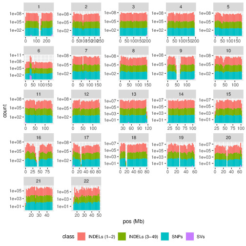

# Exploratory Analysis: understand variant size distribution in repeat regions (RRs)

Goal: understand number of variants of different sizes in tandem repeats and
homopolymers.

Questions:
* how many RRs have SVs in them?
* how many RRs have SVs and some number of variant in the same repeat?
* what is the average length of variant in a RR?
* what is the variation of variant lengths in RRs?

# Method

Initial analysis on GIAB HG002 v4.2.1 VCF file and GIAB v3.0 TandemRepeats and
Homopolymers stratifications bed.

Pipeline:
1. download files
2. convert VCF to bedlike file (chrom, start, end, variant length)
   1. remove multiallelic sites
3. intersect strat bed with VCF bed file (left outer join)
4. generate plots
   1. Group variants into 4 classes based on absolute length: SNPs, INDELs
      (1-2bp), INDELs (3-49bp), SVs

# Results

