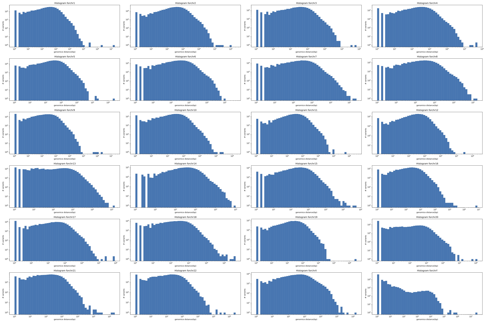

## S7 Distribution of variants

The goal of this sub-project is to conduct exploratory analysis to understand how variants are distributed in a VCF. It is done by calculating number of variants of different sizes in a larger region around any variant.

We start with a [VCF file ](https://ftp-trace.ncbi.nlm.nih.gov/ReferenceSamples/giab/data/AshkenazimTrio/analysis/HPRC-HG002.cur.20211005/HPRC-cur.20211005-align2-GRCh38.dip.vcf.gz). We make the following exploratory plots, the distance between adjacent variants, number of variants in different window sizes, a metric to identify clusters of variants.

- Input: VCF file

- Outputs: Plots that show number of variants density and good cutoffs; code along with dependencies to install (defining a conda environment or snakemake commands) to generate this for given VCF/BED, could be genome specific BED file stratification  

## Histogram

### Histogram of genomic position of variants

### Histogram of genomic distance between variants 

