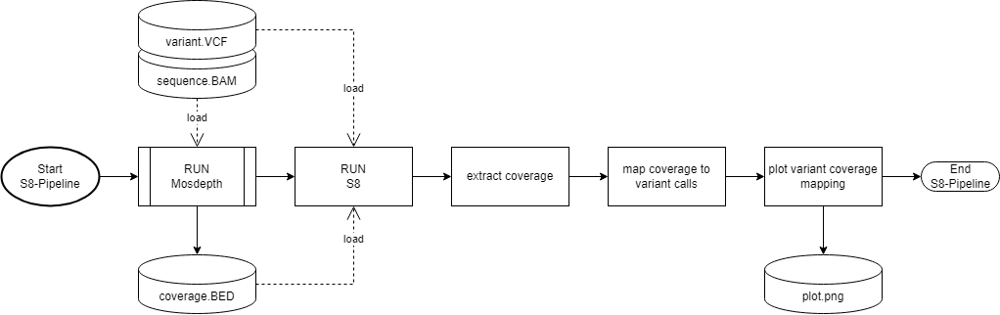
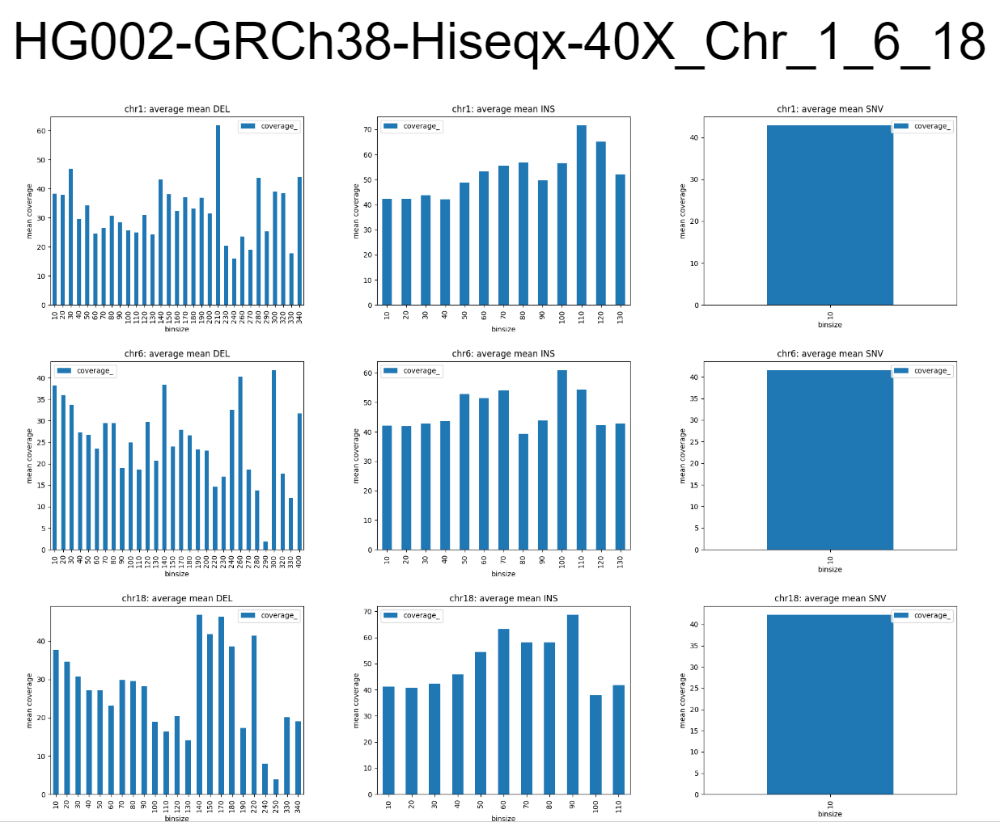

# S8 Pipeline - Coverage of variants from a bam file

Author: Philippe Sanio

The S8 pipeline maps the mean coverage of a sequence.bam file to a given variants.vcf file.
For the extraction of the coverage Mosdepth is bing used.

## Pipeline
- Inputs
  - sequence.bam
  - variants.vcf
- Output:
  - plots with the coverage mapped to the variant call.




### Mosdepth
For the coverage extraction mosdepth is being used. In this example the coverage is being calculated for each basepair (bp), the binsize of 10bp and a quality of above 20. The output will be used for S8 pipeline.

```BASH
mosdepth -n -b 1 -x -t 12 -Q 20 ./coverage ./sequence.bam
```

### S8
The S8 pipeline maps the mean coverage for each variant in the .vcf file and outputs a plot for each varient type

```BASH
python s8 coverage.per-base.bed.gz variants.vcf
```

### Results 

**Sample 1: HG002 GRCh38**

- Bam: HG002.hiseqx.pcr-free.40x.dedup.grch38.bam
    - https://storage.googleapis.com/brain-genomics-public/research/sequencing/grch38/bam/hiseqx/wgs_pcr_free/40x/HG002.hiseqx.pcr-free.40x.dedup.grch38.bam 
- VCF: HG002.hiseqx.pcr-free.40x.deepvariant-v1.0.grch38.vcf.gz
    - https://storage.googleapis.com/brain-genomics-public/research/sequencing/grch38/vcf/hiseqx/wgs_pcr_free/40x/HG002.hiseqx.pcr-free.40x.deepvariant-v1.0.grch38.vcf.gz  


Results for sample HG002-GRCh38-Hiseqx-40X: Chr 1,6 and 18:





